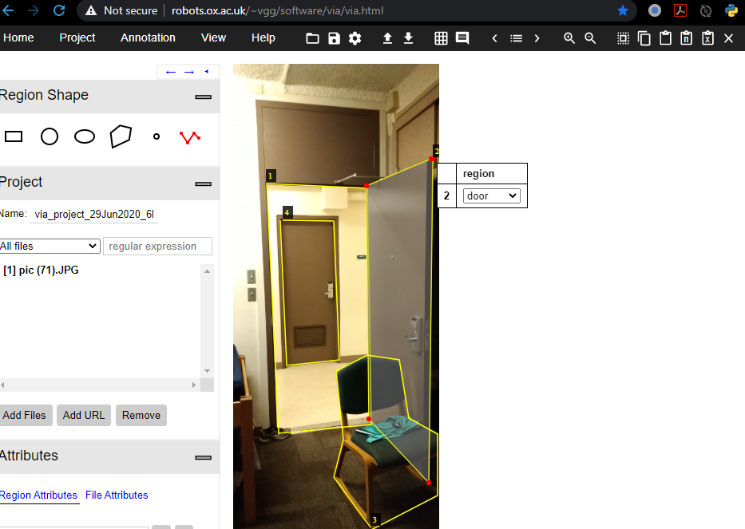
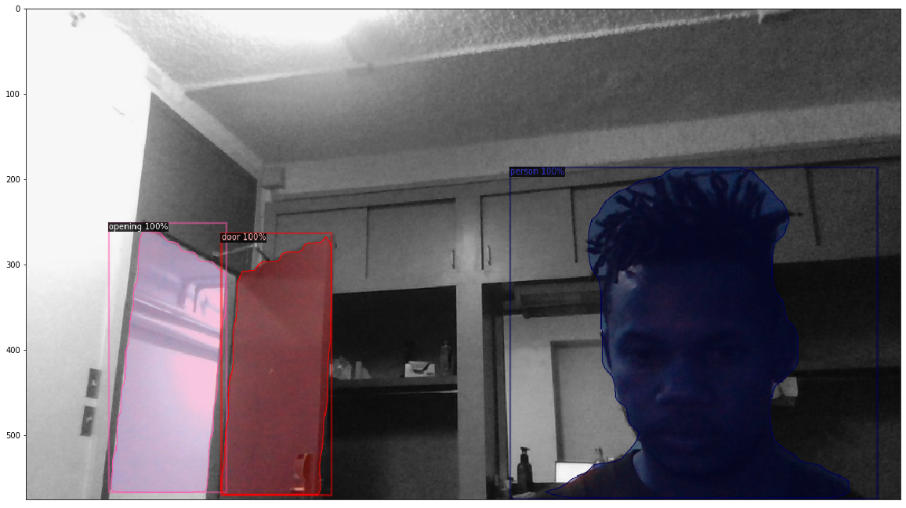
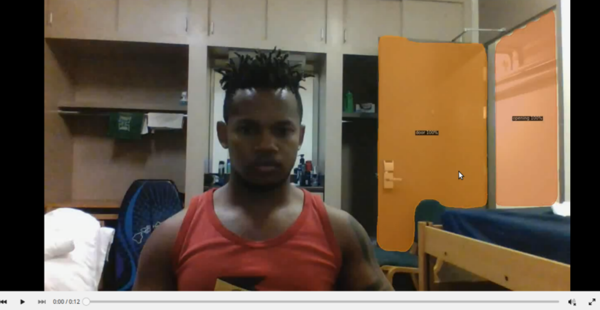

# Doortectron2
This work illustrates the use of Detectron2 on a custom dataset. While I worked on this project on data I can not share, I felt it important to share my experience with detectron2 so I quickly created a dataset of my own I could share(uncomfortably) so others struggle less with  the detectron library than I did.
 
Detectron2 is a pytorch library form Facebook AI research (FAIR) that primarily re-implements state-of-the-art object object detection algorithms using maskrcnn. While looking at the demo notebook looks fairly straightforward, but Once I tried to use it on a custom labelled dataset, I realised it was harder than I expected. I will go thought the process of coco style annotating a custom dataset and eventually fine tuning a rcnn model for segmentation.  

## Annotations

For annotating training data, I used the [vgg image annotator from oxford](http://www.robots.ox.ac.uk/~vgg/software/via/via.html).  You simply upload your images and start making polyline annotations that per image that eventually export in COCO format in a json file. you do not have to do all the annotating in one go for your dataset, you can save the json file and later upload it together with the images and pickup where you left off.



### Dataset

So as a pet project I decided to build an image based intruder alert system for my dorm room (LOL). I hand labelled about 200 images taken with both my phone and my laptop webcam, of my door both opened and closed. Since I am a grad student, I use a chair to keep my door open, so my categories are ['door', 'opening', 'chair', 'person']. 

Once you are happy with the dataset, you then convert it to polyline coco style os a list of annotations. letsgo.py:

```python

import json
import os
from PIL import Image
import pickle
path = os.getcwd()

# We mostly care about the x and y coordinates of each region

anno_file = "annotations.json"
image_path = "Path_to_images/"

def annotations_file(jsonfile):
    complete_annotations = []
    
    annotations = json.load(open(path+ jsonfile))
    annotations = list(annotations.values())[1]
    
    image_id  = list(range(1,len(annotations)+1))
    
    file_name = [annotations[k]['filename'] for k in annotations]
    
    annotations = [annotations[k] for k in annotations if annotations[k]['regions']]
    annotations = [annotations[k]['regions'] for k in range(len(annotations))]
    
    for k in range(len(annotations)):
        dict_hold = {"file_name":file_name[k],
                     "size": Image.open(image_path + file_name[k]).size,
                     "image_id":image_id[k],
                     "annotations":annotations[k]}
        complete_annotations.append(dict_hold)
    return complete_annotations

annotations = annotations_file(anno_file)

##save annotations as a pickle file
with open( "dorm_annotations.pickle" , 'wb') as file:
    pickle.dump(annotations,file, protocol=pickle.HIGHEST_PROTOCOL)
    file.close()
```

Eventually I run the model on a video stream that will allow live segmentation. Now lets go straight into it.

__import important, pytorch and detectron libs__

```python
import torch, torchvision
print(torch.__version__,torch.cuda.is_available())
device = torch.device("cuda") 

import detectron2
from detectron2.utils.logger import setup_logger
setup_logger()
import numpy as np
import cv2
import pickle
import random
from PIL import Image
import pandas as pd
from matplotlib import pyplot as plt
import numpy as np
import pandas as pd

from tqdm import tqdm
import deepdish as dd
import pycocotools as pycoco
import warnings
import os
warnings.filterwarnings("ignore")

from detectron2 import model_zoo
from detectron2.engine import DefaultPredictor
from detectron2.config import get_cfg
from detectron2.utils.visualizer import Visualizer
from detectron2.data import MetadataCatalog
from detectron2.data import DatasetCatalog, MetadataCatalog
from detectron2.structures import BoxMode
from skimage import measure
torch.cuda.empty_cache()
```
 
 ### Register your dataset to detectron2
 
 first need to register a dataset in the coco formart to work with predefined data loaders
 
 ```python
 def get_annos():
    with open('dorm_annotations_3.pickle', 'rb') as f:
        annotations = pickle.load(f)
        
    from sklearn.model_selection import train_test_split as tts
    train_annotations,test_annotations = tts(annotations,test_size = 0.3, random_state = 75, shuffle = True)
    data = {'train':train_annotations,'val':test_annotations}
    return data

def category_id(classname):
    if classname =='door':
        return 0
    elif classname =='opening':
        return 1
    elif classname =='person':
        return 2
    else:
        return 3

def create_dataset(annotation):
    dataset_dicts = []
    image_path = os.getcwd().replace("src",'images') + '/'
    for im in range(len(annotation)):
        dict1 = {}
        
        dict1["file_name"] = image_path+annotation[im]["file_name"]
        height, width = cv2.imread(dict1["file_name"]).shape[:2]
        dict1["height"] = height
        dict1["width"] = width
        dict1["image_id"] = (im+1)
        
        objs = []
        for anno in annotation[im]['annotations']:
            #assert not anno["region_attributes"]
            try:
                cat =  category_id(anno['region_attributes']['region'])
                anno = anno["shape_attributes"]
                px = anno["all_points_x"]
                py = anno["all_points_y"]
                poly = [(x+0.5, y+0.5) for x,y in zip(px,py)]
                poly = [p for x in poly for p in x]

                obj = {
                    "bbox":[np.min(px), np.min(py), np.max(px), np.max(py)],
                    "bbox_mode":BoxMode.XYXY_ABS,
                    "segmentation": [poly],
                    "category_id":cat,
                    "iscrowd":0,
                    }
                objs.append(obj)
            except Exception as e:
                print("image  "+  dict1["file_name"] + ": ", e)
            
        dict1["annotations"] = objs
        
        dataset_dicts.append(dict1)
    return dataset_dicts


def register_dset():
    DatasetCatalog.clear()
    for d_set in data:
        DatasetCatalog.register("doornet_%s"%d_set, lambda d_set=d_set: create_dataset(data[d_set]))
        MetadataCatalog.get("doornet_%s"%d_set).set(thing_classes = ["door",'opening', 'person','chair'])

### load annotations, Register dataset
data = get_annos()
register_dset()
```
 
Now create a detectron config with resnet50 weights for coco instance segmentation and defaultPredictor and train.

```python
cfg =get_cfg()
cfg.merge_from_file(model_zoo.get_config_file("COCO-InstanceSegmentation/mask_rcnn_R_50_FPN_3x.yaml"))
cfg.MODEL.ROI_HEADS.SCORE_THRESH_TEST = 0.6 #model threshold
cfg.MODEL.WEIGHTS = model_zoo.get_checkpoint_url("COCO-InstanceSegmentation/mask_rcnn_R_50_FPN_3x.yaml")
predictor = DefaultPredictor(cfg)

from detectron2.engine import DefaultTrainer
from detectron2.config import get_cfg
import os

cfg = get_cfg()
cfg.merge_from_file(model_zoo.get_config_file("COCO-InstanceSegmentation/mask_rcnn_R_50_FPN_3x.yaml"))
cfg.DATASETS.TRAIN = ("doornet_train",)
cfg.DATASETS.TEST = () 
cfg.DATALOADER.NUM_WORKERS = 4
cfg.MODEL.WEIGHTS = model_zoo.get_checkpoint_url("COCO-InstanceSegmentation/mask_rcnn_R_50_FPN_3x.yaml")  # initialize from model zoo
cfg.SOLVER.IMS_PER_BATCH = 4
cfg.SOLVER.BASE_LR = 0.00035
cfg.SOLVER.MAX_ITER = 15000    # 300 iterations seems good enough, but you can certainly train longer
cfg.MODEL.ROI_HEADS.BATCH_SIZE_PER_IMAGE = 128   # faster, and good enough for this toy dataset
cfg.MODEL.ROI_HEADS.NUM_CLASSES = 4  # only has one class (ballon)

os.makedirs(cfg.OUTPUT_DIR, exist_ok=True)
trainer = DefaultTrainer(cfg) 
trainer.resume_or_load(resume=False)
trainer.train()
```
### Inference
After training, you can visualize the models predictions on a test set. to display multiple prediction images in a grid change values of r and c, then replace axarr.imshow(...) with axarr[i][j].imshow(...).

```python
from detectron2.utils.visualizer import ColorMode

# load weights
cfg.MODEL.WEIGHTS = os.path.join(cfg.OUTPUT_DIR, "model_final.pth")
cfg.MODEL.ROI_HEADS.SCORE_THRESH_TEST = 0.75   # set the testing threshold for this model
# Set training data-set path
cfg.DATASETS.TEST = ("doornet_val", )
# Create predictor (model for inference)
predictor = DefaultPredictor(cfg)

plt.figure()

r = 1
c = 1
#subplot(r,c) provide the no. of rows and columns
f, axarr = plt.subplots(r,c,figsize=(20,12))
plt.xticks([])
plt.xticks([])
i=0
j=0

dataset_dicts = create_dataset(data["val"])
for d in random.sample(dataset_dicts, r*c):
    if i == r:
        i = 0
        j+=1
        
    im = cv2.imread(d["file_name"])
    outputs = predictor(im)
    v = Visualizer(im[:, :, ::-1],
                   metadata=fish_metadata, 
                   scale=0.8, 
                   instance_mode=ColorMode.IMAGE_BW   # remove the colors of unsegmented pixels
    )
    v = v.draw_instance_predictions(outputs["instances"].to("cpu"))
    axarr.imshow(Image.fromarray(v.get_image()[:, :, ::-1]))
    i+=1
plt.show()
```


## Video predictions
So my goal was to have this run live on my camera, but I have an issue I ddnt solve and kind of went on to other projects. I have detectron installed and running on a remote machine, on which I did all my training, but I couldnt figure out how envoke my local Webcam from my jupyter notebook thats running on a remote cluster. Also my local machine doesnt meet the minimum detectron requirements so I couldnt simply run my trained model locally.  

But I still wanted to test detectron2 on video so as a work around, I recorded video on my machine and uploaded that to the the cluster. The code below assumes you have a saved video clip, but can easily change for live video stream.

```python
import detectron2
from detectron2.utils.logger import setup_logger
setup_logger()
import numpy
import tqdm
import cv2
import pyaudio
import wave
import threading
import time
import subprocess

from detectron2 import model_zoo
from detectron2.engine import DefaultPredictor
from detectron2.config import get_cfg
from detectron2.data import DatasetCatalog, MetadataCatalog
from detectron2.utils.video_visualizer import VideoVisualizer
from detectron2.utils.visualizer import ColorMode, Visualizer
from detectron2.structures import BoxMode
from skimage import measure
from mail import Email_pypy
torch.cuda.empty_cache()

#### init video
video = cv2.VideoCapture('dom_test1.mp4')
#video = cv2.VideoCapture(0)
width = int(video.get(cv2.CAP_PROP_FRAME_WIDTH))
height = int(video.get(cv2.CAP_PROP_FRAME_HEIGHT))
frames_per_second = video.get(cv2.CAP_PROP_FPS)
num_frames = int(video.get(cv2.CAP_PROP_FRAME_COUNT))

video_writer = cv2.VideoWriter("out.mp4",
                               fourcc = cv2.VideoWriter_fourcc(*"mp4v"),
                               fps = frames_per_second,
                               frameSize = (width,height),
                               isColor = True)

cfg.MODEL.WEIGHTS = os.path.join(cfg.OUTPUT_DIR, "model_final.pth")
cfg.DATASETS.TRAIN = ("doornet_train",)
cfg.MODEL.ROI_HEADS.SCORE_THRESH_TEST = 0.75
predictor = DefaultPredictor(cfg)

v  = VideoVisualizer(MetadataCatalog.get("doornet_train"), ColorMode.IMAGE)

```

I put in a trigger in the video frame loop for sending an email when my door goes from closed to open and a person is in the frame. You could add a line to play an alarm sound.

```python

def show_webcam(video, maxFrames, mirror=False):
    readFrames = 0
    closed = False
    switch = False
    swinumy = 0
    message = ""
    while True:
        ret_val, img = video.read()
        
        if not ret_val:
            break
            
        if mirror: 
            img = cv2.flip(img, 1)
            
        outputs = predictor(img)
        
        if closed and any(outputs["instances"].to("cpu").pred_classes == 1) and any(outputs["instances"].to("cpu").pred_classes == 2):
            swinumy+=1
            cv2.imwrite("intruder_open_%s.png"%swinumy, img)
            message = " Door Open, image number: %s"%swinumy
            switch =  True
            closed = False
        elif closed == False and all(outputs["instances"].to("cpu").pred_classes == 0):
            swinumy+=1
            cv2.imwrite("intruder_closed_%s.png"%swinumy, img)
            message = "Door Closed, image number: %s"%swinumy
            switch =  True
            closed = True
        else:
            switch =  False
        
        if switch:
            Email_pypy(message)
            
            
        img = cv2.cvtColor(img,cv2.COLOR_RGB2BGR)
        
        visualization  = v.draw_instance_predictions(img, outputs["instances"].to("cpu"))
        
        visualization = cv2.cvtColor(visualization.get_image(), cv2.COLOR_RGB2BGR)
        
        yield visualization
        
        readFrames -= -1
        if readFrames > maxFrames or (cv2.waitKey(10) & 0xff == ord('q')):
            print("CAMERA CLOSING")
            break

```
And now for running the model on each frame in a loop

```python
print("PRESS ESC TO QUIT")
num_frames = 1600
from tqdm import tqdm
for visualization in tqdm(show_webcam(video, num_frames, mirror=True), total = num_frames):
    cv2.imwrite("POSE  detectron2.png", visualization)
    video_writer.write(visualization)

video.release()
video_writer.release()
cv2.destroyAllWindows()
```
### Metrics

#### Average Precision
By default, mask c-rnn measures performance in terms of Average precision. Average precision (AP) is a weighted average of the precision score at each confidence threshold, where the weights are calculated as the increase in recall from between thresholds. AP like AUC  both capture the area under the precision, recall curve but AP is more interpretable.

#### Intersection over Union
In segmentation and detection tasks, measuring performance is non-trivial, there are multiple tasks involved. Detection, classification, and segment mask prediction. Do we measure segmentation overlap, given classification performance, or do we assume the correct classes, and only measure the overlap of ground-truth, and prediction mask pixels? So if we take detected object classes, it is obvious that if the class labels are off w.r.t the true object label ID, then its bad performance, but what if there is an overlap? meaning correct class predictions for all objects in the image but we want to know how well we can locate whole objects in the image. 

Intersection over Union (IoU)  measures the overlap of 2 regions in an image as a percentage of the total space they jointly occupy. The thresholds at which the precision is calculated is based on different IoU values, generation multiple ROC curves, and we eventually measure the mean average precision( mAP ), from all these curves.

#### Results
we have mAP results per object class in the dataset and the performance can and does differ per class.


### Preview
Click on the image to watch the video.

[](https://youtu.be/Ksqib9bJKCU)

### Credit
* Most of the detectron training setup is from the official documentation and [examples](https://github.com/facebookresearch/detectron2/tree/master/projects) on detectron2's [git repo](https://github.com/facebookresearch/detectron2)

* Video IO from Satya mallick's [learnopencv](https://www.learnopencv.com/read-write-and-display-a-video-using-opencv-cpp-python/)
